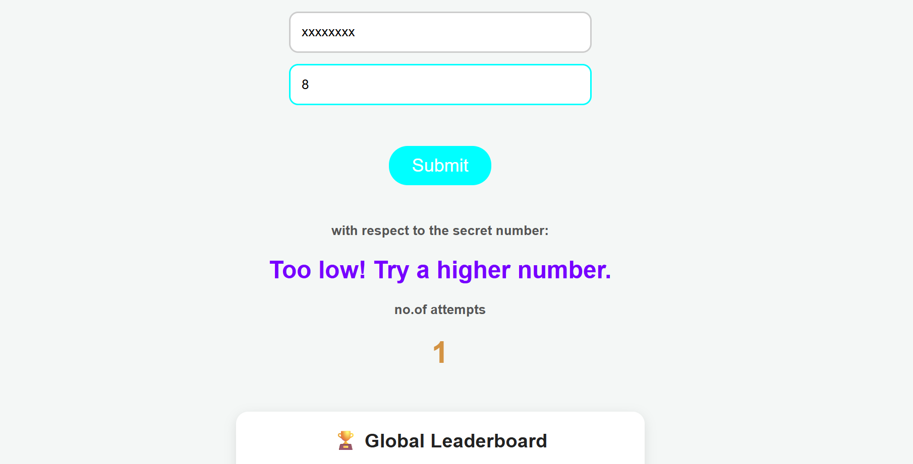

# 🎯 Global Number Guessing Game

A browser-based number guessing game with a **global leaderboard powered by Supabase**. Players compete to guess the secret number using the fewest attempts and earn a place in the Top 10 rankings.

---

## 🚀 Features

- 🎮 Number guessing game (1–100)
- 👤 Player name support
- 🏆 Global leaderboard
- 📈 Tracks personal best scores
- ⌨️ Press Enter to submit guesses
- 🔄 Automatic leaderboard updates
- 📱 Responsive interface

---

## 📷 Preview



---

## 🛠 Tech Stack

- HTML5
- CSS3
- JavaScript (Vanilla JS)
- Supabase Database

---

## 📂 Project Structure

```
.
├── index.html
├── style.css
├── index.js
└── README.md
```

---

## 🎮 How to Play

1. Enter your name.
2. Guess a number between **1 and 100**.
3. You'll receive hints:

- Too High 🔺
- Too Low 🔻

4. Keep guessing until you find the correct number.
5. Your score (number of attempts) is saved.
6. If you beat your previous record, the leaderboard updates automatically.

---

## 🏆 Leaderboard Logic

- New players are inserted into the database.
- Existing players only update their score if they use **fewer attempts**.
- Top 10 players are displayed in ascending order of attempts.

---

## ⚙️ Installation

Clone the repository:

```bash
git clone https://github.com/yourusername/global-number-guessing-game.git
```

Open the project folder:

```bash
cd global-number-guessing-game
```

Run locally:

```bash
# Using VS Code Live Server
Right Click index.html → Open with Live Server
```

---

## 🗄 Database Schema

Table: `scores`

| Column | Type |
|----------|------|
| userName | text |
| attempts | integer |

---

## 🔮 Future Improvements

- Multiple difficulty levels
- Dark mode
- Timer mode
- Previous guesses display
- Sound effects
- Multiplayer rooms
- Backend-generated secret numbers
- Achievements and badges

---

## 🔒 Security Notes

Currently, the secret number is generated in the browser and the leaderboard uses a public Supabase client key.

For production deployments:

- Enable Row Level Security (RLS)
- Validate scores server-side
- Move game logic to a backend API

---

## 👨‍💻 Author

Made with ❤️ using HTML, CSS, JavaScript, and Supabase.

---

## 📜 License

MIT License

Feel free to fork, improve, and contribute!
